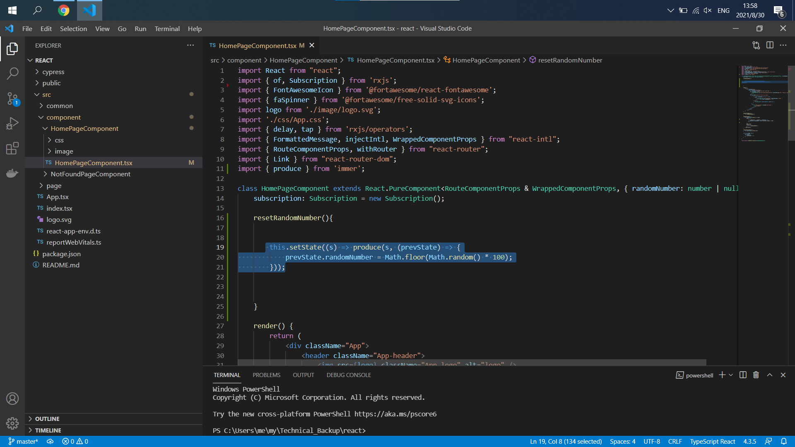

- Start Date: 2021-09-14
- RFC PR: (leave this empty)
- React Issue: (leave this empty)

# Summary

Hello, I am a programmer.
When I use PureComponent, it is very efficient. But React does not provide a setState method that can modify immutable data structures.   
Therefore, the immer library is used in the setState method to implement the modification of immutable data.   
You can consider absorbing immer, and then provide an easy-to-use setState method.   
   
Here are more examples of use.   
   

# Basic example

I look forward to using the setState method like this.   

# Motivation

Why are we doing this? What use cases does it support? What is the expected
outcome?

Please focus on explaining the motivation so that if this RFC is not accepted,
the motivation could be used to develop alternative solutions. In other words,
enumerate the constraints you are trying to solve without coupling them too
closely to the solution you have in mind.

# Detailed design

This is the bulk of the RFC. Explain the design in enough detail for somebody
familiar with React to understand, and for somebody familiar with the
implementation to implement. This should get into specifics and corner-cases,
and include examples of how the feature is used. Any new terminology should be
defined here.

# Drawbacks

Why should we *not* do this? Please consider:

- implementation cost, both in term of code size and complexity
- whether the proposed feature can be implemented in user space
- the impact on teaching people React
- integration of this feature with other existing and planned features
- cost of migrating existing React applications (is it a breaking change?)

There are tradeoffs to choosing any path. Attempt to identify them here.

# Alternatives

What other designs have been considered? What is the impact of not doing this?

# Adoption strategy

If we implement this proposal, how will existing React developers adopt it? Is
this a breaking change? Can we write a codemod? Should we coordinate with
other projects or libraries?

# How we teach this

What names and terminology work best for these concepts and why? How is this
idea best presented? As a continuation of existing React patterns?

Would the acceptance of this proposal mean the React documentation must be
re-organized or altered? Does it change how React is taught to new developers
at any level?

How should this feature be taught to existing React developers?

# Unresolved questions

Optional, but suggested for first drafts. What parts of the design are still
TBD?
